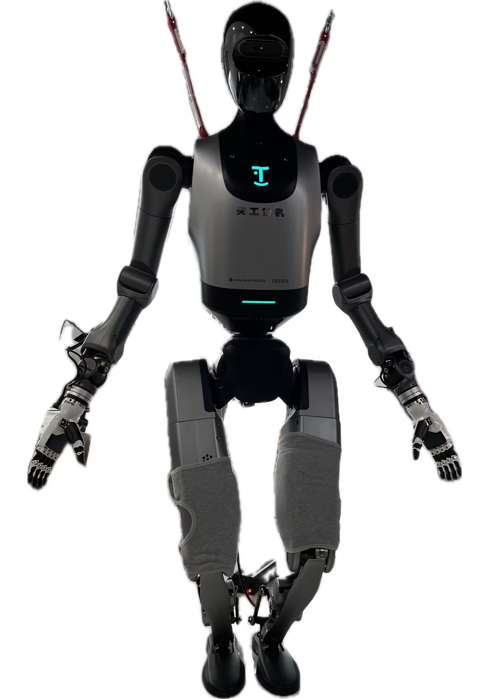
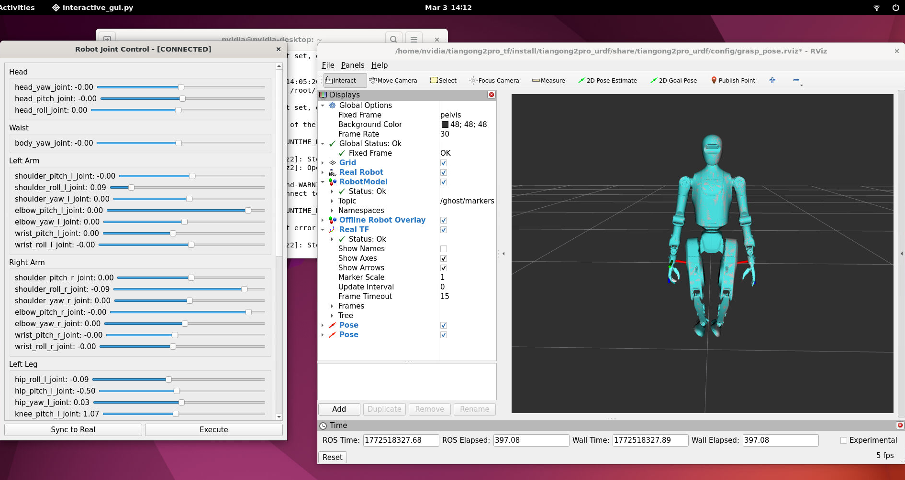
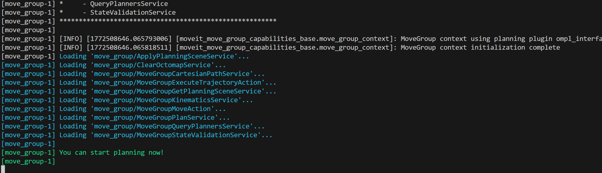
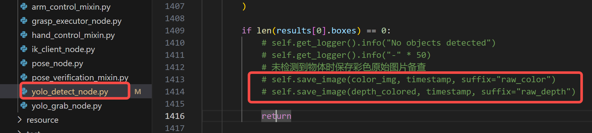
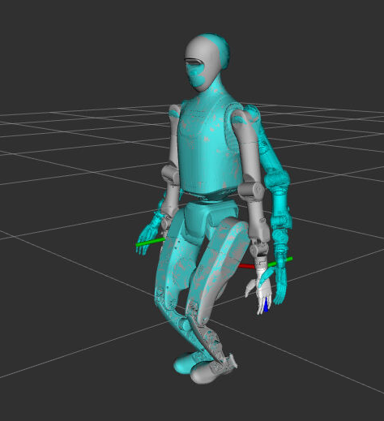
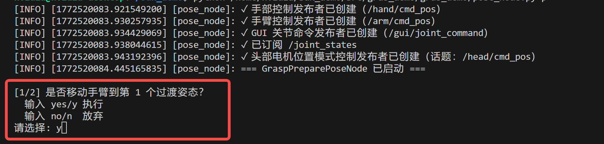
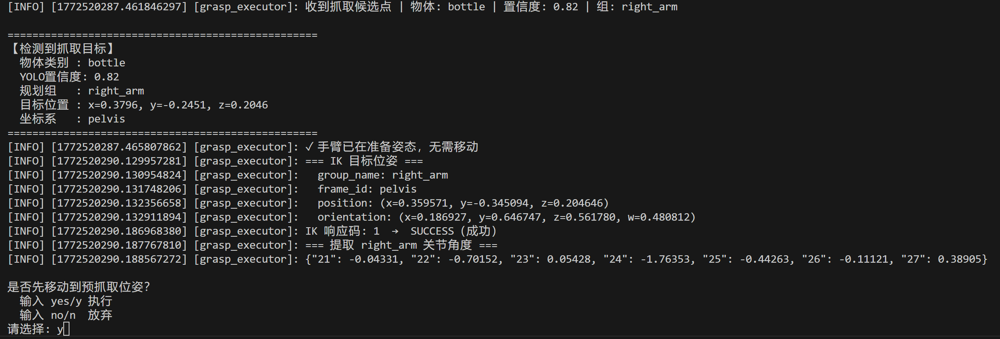
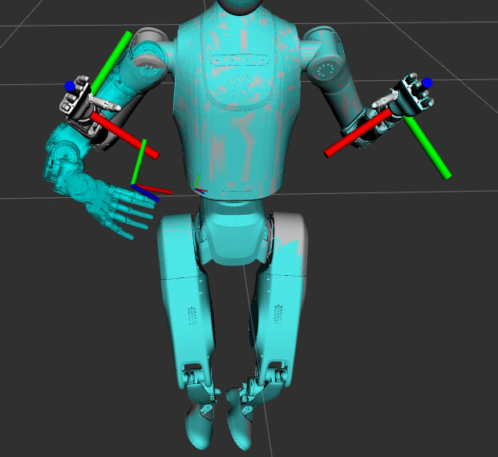
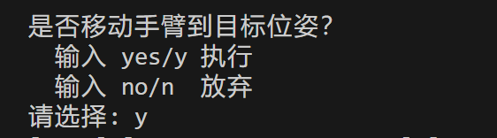

# 抓取示例

## 1、准备项目
需要准备的项目有两个：
1. tiangong2pro_tf
2. tk_sdk_demo

```bash
git clone "https://github.com/UBTECH-Robot/tiangong2pro_tf.git"
git clone "https://github.com/UBTECH-Robot/tk_sdk_demo.git"
```

将两个项目都放到天工 192.168.41.2 的 orin 板上，就会有如下两个目录：
/home/nvidia/tiangong2pro_tf/
/home/nvidia/tk_sdk_demo/

## 2、环境安装

如下步骤描述的是详细安装过程，有兴趣可以了解。如果不想过多了解，也可以直接执行 `bash src/grab_demo/env_install.sh` 脚本完成环境安装。

本示例是运行在 192.168.41.2 的 orin 板上，所以以下安装步骤都是在该 orin 板上进行。

#### 安装 ROS 图像相关
```bash
sudo apt update && sudo apt install -y \
  ros-humble-cv-bridge \
  ros-humble-image-transport \
  ros-humble-sensor-msgs \
  python3-opencv \
  python3-numpy
```

#### 安装Python依赖
```bash
pip install -i https://mirrors.cloud.tencent.com/pypi/simple tqdm==4.66.1 numpy==1.23.5 pandas==1.3.5 seaborn==0.13.0 thop py-cpuinfo==9.0.0 opencv-python==4.11.0.86

pip install -i https://mirrors.cloud.tencent.com/pypi/simple ultralytics==8.3.232 torchvision==0.22.0 --no-deps
```
#### 安装 libnccl2 库文件

pytorch将会需要 libnccl.so.2 库，所以先安装。

项目下的 src/grab_demo 目录内有一个 libnccl2_2.22.3-1+cuda12.6_arm64.deb 文件，安装它。
```bash
sudo dpkg -i libnccl2_2.22.3-1+cuda12.6_arm64.deb
# 然后刷新缓存
sudo ldconfig
```

确认该库文件可以被找到：
```bash
ldconfig -p | grep libnccl.so.2
```
输出应该类似如下：
```bash
        libnccl.so.2 (libc6,AArch64) => /lib/aarch64-linux-gnu/libnccl.so.2
```

#### 安装支持arm架构GPU的torch

项目下的 src/grab_demo 目录内有一个 torch-2.7.0-cp310-cp310-linux_aarch64.whl 文件，是torch 2.7.0的python库安装文件，其已支持 orin 板的 GPU 。直接安装即可。
```bash
pip install torch-2.7.0-cp310-cp310-linux_aarch64.whl
```

如果不使用该 torch 的安装包，而是直接使用 pip install torch 进行安装，将会默认安装不带GPU支持的 torch，这样的话用yolo进行物体识别的时候会比较慢。

安装完成后，可执行如下命令进行检查：
```bash
python3 - << 'EOF'
import torch
import ultralytics
import numpy as np
print("torch:", torch.__version__)
print("ultralytics:", ultralytics.__version__)
print("numpy:", np.__version__)
print("CUDA:", torch.cuda.is_available())
print("compiled cuda:", torch.version.cuda)
print("cudnn:", torch.backends.cudnn.version())
EOF
```

等待数秒后，将会输出如下：
```bash
torch: 2.7.0
ultralytics: 8.3.232
numpy: 1.23.5
CUDA: True
compiled cuda: 12.6
cudnn: 90300
```

为检测 orin 上的GPU真的可以使用上，已将如下脚本保存成 test_gpu.py 文件，可直接运行：
```Python
import torch, time

# x = torch.randn(4096, 4096, device="cpu")
# y = torch.randn(4096, 4096, device="cpu")
x = torch.randn(4096, 4096, device="cuda")
y = torch.randn(4096, 4096, device="cuda")

t0 = time.time()

for idx in range(100):
    t1 = time.time()
    torch.cuda.synchronize()
    z = x @ y
    torch.cuda.synchronize()
    print(f"Iteration {idx + 1}: GPU matrix multiply time:", time.time() - t1)

print("GPU matrix multiply time:", time.time() - t0)
```

同时打开新终端运行 `tegrastats` 命令，确认GPU使用率是否有提升，也就是查看输出中的每一行的 GR3D_FREQ 后面的百分数是否有变化且值比较大。如果一直是0，说明没有使用上GPU，反之则说明torch已在使用GPU做计算。

也可切换该脚本内的注释以在cpu和gpu运行之间切换，同时观察 `tegrastats` 终端的输出。

#### 确保yolo模型存在

检查根目录下是否有 yolo_models 目录，其内是否存在 yolov8n.pt 文件，这就是yolo的预训练模型。

当前使用的是 [8.2.0的yolov8n.pt](https://github.com/ultralytics/assets/releases/download/v8.2.0/yolov8n.pt) 模型，所有公开模型的信息可到[官方github](https://github.com/ultralytics/assets/releases/)查看

#### 安装moveit

```bash
sudo apt install ros-humble-moveit ros-humble-moveit-ros-visualization
```

如果网速过慢，可尝试改用清华的apt源。`vnc/sources.list.arm64` 就是ubuntu22.04 arm架构的清华apt源。可先备份当前 `/etc/apt/sources.list` 文件，再将 `vnc/sources.list.arm64` 移动成 `/etc/apt/sources.list` 文件，然后进行安装，安装完成之后再还原回去。会使用到的命令大体如下：
```bash
sudo cp /etc/apt/sources.list /etc/apt/sources.list.20260303.bak
sudo cp vnc/sources.list.arm64 /etc/apt/sources.list
# installing...
sudo rm /etc/apt/sources.list
sudo mv /etc/apt/sources.list.20260303.bak /etc/apt/sources.list
```


## 3、编译

1. 编译 tiangong2pro_tf 。

```bash
cd ~/tiangong2pro_tf && colcon build
echo "[ -f ~/tiangong2pro_tf/install/setup.bash ] && source ~/tiangong2pro_tf/install/setup.bash" >> ~/.bashrc
. ~/tiangong2pro_tf/install/setup.bash
```

2. 编译 tk_sdk_demo 。
```bash
cd ~/tk_sdk_demo && colcon build
echo "[ -f ~/tk_sdk_demo/install/setup.bash ] && source ~/tk_sdk_demo/install/setup.bash" >> ~/.bashrc
. ~/tk_sdk_demo/install/setup.bash

```

## 4、运行

1. 准备工作

先需要让双臂处于可控制状态，方法之一就是通过遥控器让天工进入僵停状态(C按钮)后，再进入半身控制模式。具体步骤如下：

- 确认 proc_manager.service 是启动的（默认就是启动的，如果你没有修改过的话）: `sudo systemctl status proc_manager.service`

- 如果没有启动，则启动它: `sudo systemctl start proc_manager.service`

- 启动遥控器，短按A键自检
- 自检成功后，短按D键回零
- 短按C键进入僵停状态
- 稍微降低移位机的高度，让天工双脚落地，双脚掌可以撑到地面就可以，仅提供一个支撑作用，不需要再回零后进入站立状态，天工背部的挂钩还是通过绳子和移位机连接在一起的，大概的姿态如下：

- 确保此时已在遥控器按过C了，天工是处于僵停状态的
- F下拨，然后长按A，进入上肢控制模式（一个常见的错误操作是，天工还处于回零状态时，就执行这个操作，这种情况如果天工本来的姿态是比较好的，它可能会正常进入站立模式，但如果本来姿态不好，有可能会双脚乱蹬，抖动，站立不稳等。）


2. 打开新的终端，启动 tf 服务。

注意这一步不可以直接在普通 ssh 连接的终端运行，因为这一步会打开rviz2的窗口，需要有桌面或者有xserver转发。
```bash
ros2 launch tiangong2pro_urdf grasp_pose.launch.py
```
也可以这样，用一台安装了ubuntu22.04的笔记本A和天工直接网线连接，并且笔记本A也配置了192.168.41网段，然后将 tiangong2pro_tf 项目放在笔记本A上，编译后，用 grasp_pose.launch.py 文件启动服务。也是可以正常打开rviz窗口并且连接到天工的，而且帧率比较高。

启动后会出现如下画面：


打开后可以在弹出的 Robot joint Control 窗口，单击 `Sync to Real` 按钮，让rviz里天工的影子和天工重合到一起。

3. 打开新终端，启动moveit2服务。
```bash
ros2 launch moveit2_config move_group.launch.py
```
注意这一步启动服务需要的时间比较长，需要等待直到终端输出如下：



4. 确保头部相机服务是启动的。
```bash
sudo systemctl status orbbec_head.service
```

如果没有启动，则启动它。
```bash
sudo systemctl start orbbec_head.service
```

5. 打开新终端，启动物体检测服务。
```bash
python /home/nvidia/tk_sdk_demo/src/grab_demo/grab_demo/yolo_detect_node.py --target_classes bottle
```
- target_classes 参数指定的即是需要识别的物体，常见的可识别可抓取的有 bottle、apple、orange，推荐使用 bottle ，也就是用常见的不透明的矿泉水瓶大小的瓶子即可。

检测到有指定物体时，彩色图像和深度图像都会保存在 saved_data/grab_node 目录内。对于没有检测到指定物体的情况，目前不会保存任何图片，如果调试时有需要在没有检测到物体时也保存图片，可修改代码的如下位置，取消相应的注释：



6. 打开新终端，确保安全的情况下，用如下脚本将机器人双臂调整到合适位置。

注意，这两个脚本执行的时候，要确保机器人周围没有障碍物以免机器人双臂抬起和放下的时候碰撞到障碍物而损坏。

```bash
# 双臂进入准备状态：
python /home/nvidia/tk_sdk_demo/src/grab_demo/grab_demo/pose_node.py p
```

如果要让双臂自然放下，可使用如下脚本。
```bash
# 双臂收回到结束姿态：
python /home/nvidia/tk_sdk_demo/src/grab_demo/grab_demo/pose_node.py e
```

这两个命令运行的时候，都会发布下一步的姿态，可在rviz窗口里预览。



可以看到真正姿态后有一个淡蓝色虚影，它就是确认后手臂会运动到的位置。



也可以用如下命令验证灵巧手是否可正常控制：

```bash
# 张开手指（放置动作）
python /home/nvidia/sdk_demo/src/grab_demo/grab_demo/hand_control_mixin.py open

# 闭合手指（抓取动作）
python /home/nvidia/sdk_demo/src/grab_demo/grab_demo/hand_control_mixin.py close
```

7. 打开新终端，启动抓取服务
```bash
python /home/nvidia/tk_sdk_demo/src/grab_demo/grab_demo/grasp_executor_node.py
```
当检测到指定物体时，抓取服务会询问是否要执行抓取。



下图就是rviz里显示的确认后将会移动到的姿态：



为确保安全，每一次移动手臂之前都会要求用户确认：



用户需确保手臂将要移动到的位置不会有障碍物以及不会碰撞到桌面。同时需要有一个人仔细看好天工的动作，一手臂有碰撞障碍物风险，立刻按下急停按钮！以免损坏天工双臂和灵巧手。